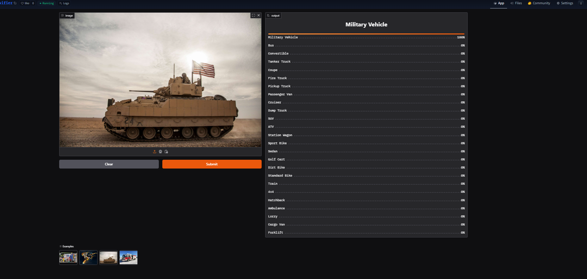

# Vehicle-Classifier
An image/object classification model which involves data collection, preprocessing, cleaning, traning, deployment and API integration
The model can classify following classes of land vehicles:
1. Military Vehicle
2. Bus
3. Convertible
4. Tanker Truck
5. Coupe
6. Fire Truck
7. Pickup Truck
8. Passenger Van
9. Cruiser
10. Dump Truck
11. SUV
12. ATV
13. Station Wagon
14. Sport Bike
15. Sedan
16. Golf Cart
17. Dirt Bike
18. Standard Bike
19. Train
20. 4x4
21. Hatchback
22. Ambulance
23. Lorry
24. Cargo Van
25. Forklift

# Data Collection & Preparation
Collection: Used fastai's method to search by term name and save images <br/>
Dataloader: Used DataBlock to set up dataloaders for efficient GPU use <br/>
Data Augmentation: Used fastai's method to augment data for compensating imbalance in the dataset <br/>
Details are given in the ```notebooks/```

# Training & Data Cleaning
To understand the current status of data distribution I trained a model right away without cleaning. Then progressively I cleaned and tried different model architecture to best fit our pupose. <br/>
Training: Used resnet18, resnet34, resnet50 and convnext_small architectures for finding the best model. Later I found that convnext_small is the one that outperforms all other models I have tried - then trained 4 times for 5, 5, 1, 6 epochs respectively to get the best model. <br/>
Data Cleaning: Used fastai's ImageClassifierCleaner widget for cleaning <br/>
# Deployment
I deployed in hugging face which uses GRADIO app. The implementation is there in ```deployment/``` folder.

# API integration with GitHub Pages
Using github pages I accessed the deployed hugging face model via API endpoint and made input-output functionality available [here](https://sajjadhossain43.github.io/Vehicle-Classifier/)

